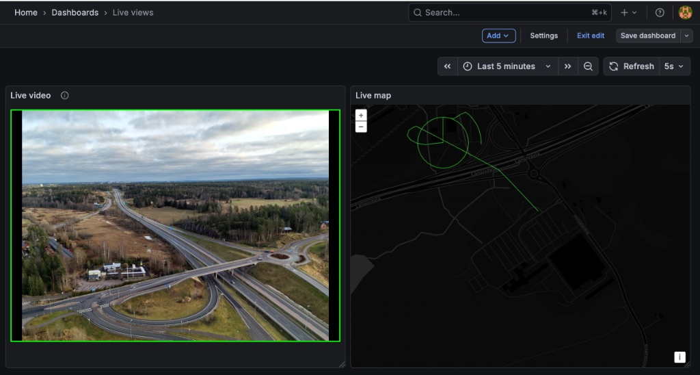

# Autel Mission Control

[]()
[](LICENSE)
[]()


> **A centralized mission control hub for Autel drones, delivering specialized dual-lane real-time video streaming and comprehensive telemetry logging via Docker.**

---

### 📢 Milestone Reached: v1.0.0 Stable
**[Click here to view the RELEASENOTES.md for the v1.0.0 changelog.](RELEASENOTES.md)**

---

## 📖 Table of Contents
1.  [Project Overview](#-project-overview)
2.  [Key Features](#-key-features)
3.  [System Architecture (Evolution)](#-system-architecture)
4.  [Connectivity & Drone Config](#-connectivity--usage)
5.  [Dashboards](#-mission-control--engineering-dashboards)
6.  [Quick Start Deployment](#-quick-start-deployment)
7.  [References](#-references--research)

---

## 🔭 Project Overview

**Autel Mission Control** is a field server designed for enterprise drone operations. It solves the critical challenge of reliable video recording over high-latency networks (ZeroTier/LTE/4G) by inverting the standard connection model.

Instead of the server "pulling" video (which often fails behind NATs/VPNs), the Drone Controller **pushes** the stream to this node. The system then captures, segments, and indexes the footage using industrial-grade fault tolerance, ensuring that even if power is lost, the mission data is saved.

## 🚀 Key Features

* 🎥 **Active "Push" DVR:** Drone initiates the connection, pushing RTSP directly to the local MediaMTX server (TCP Port 8554).
* 🛡️ **Crash-Resilient Recording:** Uses **Fragmented MP4 (fMP4)** storage. If the container crashes or power is cut, the video file is saved up to the last second (solving the "Moov Paradox").
* 🛡️ **Network Jitter Buffer:** A 10-second buffer smooths out latency spikes common on LTE/5G/ZeroTier connections, preventing recording gaps.
* 📊 **Unified Telemetry Stack:** Integrated MQTT broker, Telegraf agent, InfluxDB, and Grafana for visualizing drone data.
* 🍎 **Apple Silicon Native:** Optimized for macOS ARM64 architecture with `host` networking mode for seamless ZeroTier integration.
* 🕸️ **Web Dashboard Ready:** Automatically transmuxes RTSP feeds to **HLS (Port 8888)** for native browser playback in Grafana.

---

## 🏗️ System Architecture

### Visual Overview

The v0.9.8 architecture unifies the video and telemetry pipelines into a single, atomic Docker stack, replacing the previous microservices web.

### Visual Overview
*(Click the diagram below to enlarge)*

[](docs/architecture_v4.png)

### The Pipeline
1.  **Ingest (The "Push"):** `bluenviron/mediamtx` (TCP Port 8554) acts as the passive receiver for the Drone's RTSP connection.
2.  **Archival (The "Engine"):** `linuxserver/ffmpeg` pulls the stream locally, applies wallclock timestamps, and writes crash-proof **15-minute segments**.
3.  **Visualization (The "View"):** `grafana/grafana` pulls telemetry from InfluxDB and renders the live video via **HLS** (Port 8888).

---

## 📡 Connectivity & Usage

> **Critical:** This system operates on a **Push Model**. You must configure the Drone to send data to the server; the server will not "find" the drone automatically.

### 1. The ZeroTier "Virtual Cable"
Unlike standard setups that break when you switch networks, this project uses **ZeroTier** to create a static, encrypted tunnel.


### 2. Drone Configuration (The "Push")
Configure the **Autel Enterprise App** (Live Stream settings) to push to these endpoints:

* **Video (RTSP):** `rtsp://<SERVER_ZT_IP>:8554/live/rtsp-drone1`
* **Telemetry (MQTT):** `<SERVER_ZT_IP>` (Port 1883)

### 3. Mission Control Outputs (The "View")
* **Web Dashboard (HLS):** `http://<SERVER_ZT_IP>:8888/live/rtsp-drone1/index.m3u8` (Best for Grafana/Browser)
* **Low-Latency (RTSP):** `rtsp://<SERVER_ZT_IP>:8554/live/rtsp-drone1` (Best for VLC)

---

## 💻 Mission Control & Engineering Dashboards
The system includes a "Golden Image" Grafana dashboard (**[docs/autel_dashboard_v3.json](docs/autel_dashboard_v3.json)**) that unifies real-time video, tactical mapping, and hardware diagnostics.

### 1. The Tactical View
*Combines live video (HLS) with a geospatial map for situational awareness.*


*Real-time view showing RTSP Video Feed (Left) and Live Telemetry Map Trace (Right) during highway flight tests.*

---

### 2. The Engineering View (Hardware Forensics)
*Exposes raw sensor comparisons to detect hardware drift.*


* **🛰️ Precision Lock:** Visualizes GNSS vs. RTK satellite count delta (Goal: 50+ sats).
* **⛰️ Altitude Truth:** Plots Barometric vs. Ellipsoidal height to detect pressure drift.
* **🔋 Battery Profiling:** Monitors voltage sag under throttle load.
---  

### 📂 Repository Structure

```text
.
├── config/                  # Service configurations (MediaMTX, Telegraf)
├── docker/
│   └── docker-compose.yml   # The Unified v0.9.8 Stack
├── docs/                    # Architecture (v3), Golden Dashboards, & Research
│   ├── archive/             # Deprecated diagrams and v2 layouts
│   ├── architecture_v4.png  # Current System Flow
│   └── autel_dashboard_v3.json # Production Grafana Dashboard
├── recordings/              # Auto-segmented video files (15-min chunks)
├── scripts/                 # Operational utilities (Infra management, Monitors)
├── src/                     # Python helper modules & Legacy dashboards
├── LICENSE
├── README.md                # This file
├── RELEASENOTES.md          # Version history
└── .env.example             # Template for secrets
```

---

## 🛠️ Quick Start Deployment

1.  **Prerequisites:** Ensure Docker and Docker Compose are installed.

2.  **Configure Environment:** Create a `.env` file in the root directory with your credentials:
    ```bash
    MQTT_PORT=1883
    GRAFANA_USER=admin
    GRAFANA_PASS=your_secure_password
    INFLUX_USER=admin
    INFLUX_PASS=your_secure_influx_password
    INFLUX_ORG=autel
    INFLUX_BUCKET=telemetry
    INFLUX_TOKEN=your_generated_influx_token
    ```

3.  **Launch the Stack:**
    ```bash
    docker compose --env-file .env -f docker/docker-compose.yml up -d
    ```

4.  **Verify Connectivity:** Access Grafana at `http://localhost:3000` and check container status with `docker ps`.

---

## 📚 References & Research

* **Video Resilience Strategy:** [Solving Fragmented RTSP_MP4 Recordings.pdf](docs/Solving%20Fragmented%20RTSP_MP4%20Recordings.pdf)
* - Internal architecture document detailing the move to fMP4.
* **Video Protocols:** [VIDEO_PROTOCOLS.md](docs/VIDEO_PROTOCOLS.md) - Simplified comparison of video protocols.
* **Autel Cloud API:** [SDK Reference](https://doc.autelrobotics.com/cloud_api/en/60/30/00/10/00) - MQTT topic definitions.
* **Telemetry Schema:** [DATA_SCHEMA.md](docs/DATA_SCHEMA.md) - **(NEW)** Definition of 50+ telemetry fields (RTK, Cells, Radar etc.).
