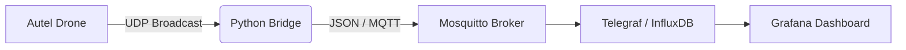

# Autel Mission Control

> **A telemetry interception, storage, and visualization pipeline for Autel Enterprise Drones.**


## 📖 Overview

**Autel Mission Control** is a localized Ground Control Station (GCS) backend designed for the **Autel Max 4T**. It bypasses the need for proprietary cloud services by capturing raw UDP broadcast packets directly from the drone controller, decoding them, and persisting them for real-time analysis.

**Key Capabilities:**
* 📡 **Telemetry Interception:** Decodes binary packets for Battery, GPS, Speed, Altitude, and RTK Status.
* 📊 **Dual-Device Tracking:** Distinguishes between Drone and Controller battery and other telemetry.
* 🗺️ **Live Operations Map:** Real-time visualization of the drone's location using Grafana Geomap.
* 🗄️ **Black Box Recording:** Stores all flight data in InfluxDB for post-flight forensics.

---

## 🏗️ System Architecture

The system runs as a hybrid pipeline using **Docker** for infrastructure and **Python** for the translation layer.



| Component | Technology | Role |
|-----------|------------|------|
| **Bridge** | Python 3.12 | Listens on UDP port, parses binary structs, publishes to MQTT. |
| **Broker** | Eclipse Mosquitto | Lightweight message transport. |
| **Database** | InfluxDB v2 | Time-series storage for high-frequency telemetry. |
| **Visualization** | Grafana | Operational dashboard (Map, Battery, Signal Health). |
| **Video** | MediaMTX | (Experimental) Low-latency RTMP/HLS streaming server. |

---

## 🚀 Quick Start

### 1. Prerequisites
* **Hardware:** MacBook Pro (M-Series) or Linux Server connected to the same Wi-Fi as the Autel Smart Controller.
* **Software:** Docker Desktop, Python 3.12+.

### 2. Installation
Clone the repository:
```bash
git clone [https://github.com/rwiren/autel-mission-control.git](https://github.com/rwiren/autel-mission-control.git)
cd autel-mission-control
```

Initialize the Python environment:
```bash
python3 -m venv venv
source venv/bin/activate
pip install -r src/requirements.txt
```

### 3. Launch Infrastructure
Start the database and dashboard containers:
```bash
docker compose --env-file .env -f docker/docker-compose.yml up -d
```

### 4. Start Telemetry Bridge
Run the translator to begin capturing data:
```bash
source venv/bin/activate
python src/bridge.py
```
> *You should see logs indicating "Connected to MQTT" and "Telemetry Received".*

---

## 📊 Dashboards

The project includes pre-configured Grafana dashboards located in `src/dashboards/`:

* **Autel Telemetry Master (v4):** The production-grade dashboard featuring:
    * **Live Map:** With "Null Island" filtering.
    * **Battery Monitors:** Separated logic for Drone vs. Controller.
    * **RTK Status:** Real-time GPS accuracy monitoring.

**To Import:**
1.  Go to Grafana (`http://localhost:3000`).
2.  **Dashboards** -> **New** -> **Import**.
3.  Upload `src/dashboards/autel_telemetry_master.json`.

---

## 📂 Project Structure

```text
├── config/           # Configuration files for Mosquitto/InfluxDB
├── docker/           # Docker Compose infrastructure
├── logs/             # Local runtime logs (ignored by Git)
├── src/
│   ├── bridge.py     # CORE: UDP to MQTT translator script
│   ├── dashboards/   # JSON exports of Grafana dashboards
├── archive/          # Deprecated scripts and older dashboard versions
└── README.md         # Documentation
```

---

## ⚠️ Disclaimer

This software is for **educational and research purposes only**.
* This project is **not affiliated with Autel Robotics**.
* Users are responsible for complying with local aviation regulations (EASA/FAA) regarding telemetry monitoring and radio frequency usage.
* No warranty is provided for the accuracy of the data. Do not use this as the primary navigation tool for flight safety.

---
*Maintained by [rwiren](https://github.com/rwiren)*
