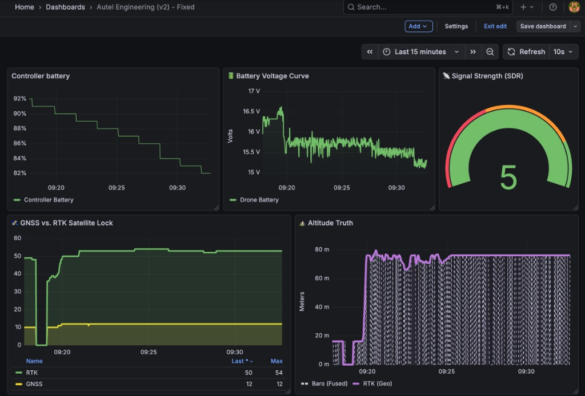
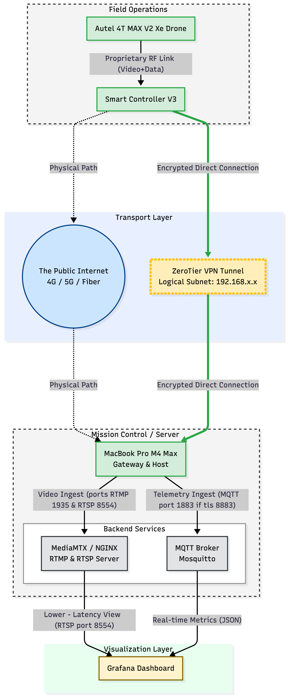

# Autel Mission Control

[]()
[](LICENSE)
[]()


> **A centralized mission control hub for Autel drones, delivering specialized dual-lane real-time video streaming and comprehensive telemetry logging via Docker.**

---

### 📢 🆕 Latest Updates: v0.9.5 released!
**[Click here to view the RELEASENOTES.md for detailed changelogs and architecture shifts.](RELEASENOTES.md)**

---

## 📖 Table of Contents
1.  [Project Overview](#-project-overview)
2.  [Key Features](#-key-features)
3.  [System Architecture](#%EF%B8%8F-system-architecture)
4.  [Connection Lanes & Usage](#-connection-lanes--usage)
5.  [Quick Start Deployment](#%EF%B8%8F-quick-start-deployment)

---

## 🔭 Project Overview

**Autel Mission Control** is a field server designed for enterprise drone operations. It solves the critical challenge of reliable video recording over high-latency networks (ZeroTier/LTE/4G) by inverting the standard connection model.

Instead of the server "pulling" video (which often fails behind NATs/VPNs), the Drone Controller **pushes** the stream to this node. The system then captures, segments, and indexes the footage using industrial-grade fault tolerance, ensuring that even if power is lost, the mission data is saved.

## 🚀 Key Features

* 🎥 **Active "Push" DVR:** Drone initiates the connection, pushing RTSP directly to the local MediaMTX server (TCP Port 8554).
* 🛡️ **Crash-Resilient Recording:** Uses **Fragmented MP4 (fMP4)** storage. If the container crashes or power is cut, the video file is saved up to the last second (solving the "Moov Paradox").
* 🛡️ **Network Jitter Buffer:** A 10-second buffer smooths out latency spikes common on LTE/5G/ZeroTier connections, preventing recording gaps.
* 📊 **Unified Telemetry Stack:** Integrated MQTT broker, Telegraf agent, InfluxDB, and Grafana for visualizing drone data.
* 🍎 **Apple Silicon Native:** Optimized for macOS ARM64 architecture with `host` networking mode for seamless ZeroTier integration.
* 🕸️ **Web Dashboard Ready:** Automatically transmuxes RTSP feeds to **HLS (Port 8888)** for native browser playback in Grafana.

---

## 🏗️ System Architecture

The v0.9.1 architecture utilizes a microservices approach to ensure stability. Video responsibilities are split into three distinct containers to prevent failure in one protocol from affecting the other.

---

### Visual Overview
*(Click the diagram below to enlarge)*

[](docs/Decision%20Path%20Selection%20Flow-2025-12-14-132635.png)

---

## 📡 Connection Lanes & Usage

> **Important:** Replace `<YOUR_IP>` with the actual LAN IP address of your host machine (e.g., `192.168.1.50`). Do **not** use `localhost` on the drone controller.

**Technical Deep Dive:** Read **[docs/VIDEO_PROTOCOLS.md](docs/VIDEO_PROTOCOLS.md)** to understand the differencies between video protocols that Autel supports.

### Lane 1: RTSP (Fast Lane - Low Latency)
Connects directly to the main media server via TCP. Best for real-time piloting cues.
* **Drone Controller Input:** `rtsp://<YOUR_IP>:8554/live/rtsp-drone1`
* **VLC / Player Output:** `rtsp://<YOUR_IP>:8554/live/rtsp-drone1`

### Lane 2: RTMP (Stable Lane - Sanitized)
Ingested by NGINX, cleaned by the FFmpeg bridge, and delivered by the main server. Best for unreliable connections.
* **Drone Controller Input:** `rtmp://<YOUR_IP>:1935/live/rtmp-drone1`
* **VLC / Player Output (Cleaned):** `rtmp://<YOUR_IP>:1936/live/rtmp-drone1`

### 💻 Web Dashboard Outputs
Both lanes are instantly available for browser playback.
* **WebRTC Feed (Lowest Latency):** `http://<YOUR_IP>:8889/live/rtsp-drone1` (or `rtmp-drone1`)
* **LL-HLS Feed:** `http://<YOUR_IP>:8888/live/rtsp-drone1`

---

### 💻 Mission Control Dashboard
The system outputs a unified "Glass Cockpit" interface, combining low-latency video with real-time tactical mapping.


* **Left Panel (Visual):**
    * **Source:** `autel_rtsp` container.
    * **Tech:** WebRTC (Port 8889) for <500ms latency.
    * **Config:** `GF_PANELS_DISABLE_SANITIZE_HTML=true` allows direct video embedding.

* **Right Panel (Tactical):**
    * **Source:** `autel_influx` container (via MQTT/Telegraf).
    * **Tech:** Grafana Geomap with Dual Layers (Route Line + Drone Icon).
    * **Data:** Visualizes real-time GPS telemetry (`lat`/`lon`) filtered to remove null island errors.

**Access Feeds Directly:**
* **WebRTC Feed:** `http://<YOUR_IP>:8889/live/rtsp-drone1`
* **HLS Feed:** `http://<YOUR_IP>:8888/live/rtsp-drone1`

---   

## 📊 Engineering & Telemetry Dashboard
This project includes a specialized **"Hardware Health" dashboard** (`src/dashboards/autel_engineering_v2.json`) designed for pre-flight checks and post-flight data forensics. Unlike standard flight apps, this view exposes raw sensor comparisons to detect hardware drift or failure.



### Key Instruments:
* **🛰️ Precision Lock (GNSS vs. RTK):**
    * Visualizes the satellite count delta between the standard consumer GPS module and the RTK (Real-Time Kinematic) module.
    * **Goal:** Verify RTK "Fixed" status (**observed 50+ satellites** in multi-constellation mode) versus standard GPS float (~12 sats) before takeoff.

* **⛰️ Altitude Truth (Barometer vs. Geometry):**
    * Plots **Barometric Altitude** (pressure-based, susceptible to drift) against **RTK Ellipsoidal Height** (geometric truth).
    * **Goal:** Detect pressure sensor drift or calibration errors in real-time by observing divergence between the solid (RTK) and dashed (Baro) lines.

* **🔋 Battery Load Profiling:**
    * High-resolution voltage monitoring (mV precision) converted to Volts.
    * **Goal:** Identify "Voltage Sag" under load. A steep dip during throttle punches indicates rising internal resistance (aging battery) even if the reported percentage remains high.

* **📡 Digital Signal Analyzer:**
    * Discrete step-graph of the SDR (Software Defined Radio) link quality (0-5 scale).
    * **Goal:** Visualize digital packet loss and signal degradation steps rather than a smoothed average, providing an instant "Go/No-Go" link status.

---  

### 📂 Repository Structure

```text
.
├── config/                  # Service configurations
│   ├── mediamtx.yml         # MediaMTX rules (TCP locking, paths)
│   ├── mosquitto.conf       # MQTT broker settings
│   └── telegraf.conf        # Telegraf data collector config
├── docker/
│   └── docker-compose.yml   # The V0.9.1 Microservices Stack
├── docs/                    # Architecture diagrams & protocol notes
├── scripts/                 # Management utilities (Reset DB, Monitor)
├── src/
│   └── dashboards/          # Frontend resources
│       ├── autel_telemetry_master.json  # Grafana Dashboard (Importable)
│       └── video_panel.html             # Standalone WebRTC Viewer
├── LICENSE
├── README.md                # This file
└── RELEASENOTES.md          # Version history and changelog
```

---

## 🌐 Connectivity: The ZeroTier "Virtual Cable"

Unlike standard setups that break when you switch from Home Wi-Fi to a Field Hotspot, this project uses **ZeroTier** to create a permanent, encrypted virtual LAN.

### The Architecture


This topology allows the **Field Unit** (Drone + Controller) and **Mission Control** (Server) to behave as if they are plugged into the same physical switch, even when miles apart on different 4G/5G networks.

### ⚡ Why We Use ZeroTier?
1.  **Static IPs Forever:**
    * The Controller is assigned `192.168.x.12`.
    * The Server is assigned `192.168.x.34`.
    * *Benefit:* We never have to reconfigure the Drone's RTMP URL when moving locations.
2.  **NAT Traversal (The "Magic"):**
    * Standard mobile hotspots (4G/5G) use CGNAT, which blocks incoming connections.
    * *Benefit:* ZeroTier punches through these barriers automatically. No port forwarding or static public IPs are needed from your ISP.
3.  **End-to-End Encryption:**
    * *Benefit:* Your live video feed and telemetry are encrypted inside the tunnel, protecting them from public internet snooping.
4.  **Simple Installation:**
    * *Benefit:* The Autel Smart Controller V3 runs Android, allowing us to simply sideload the official [ZeroTier APK](http://download.zerotier.com/dist/ZeroTierOne.apk) via the browser. No rooting or complex hacking required.

### 📡 Data Flow Summary
* **Video:** Drone -> Controller -> **ZeroTier Tunnel** -> Server (Port 1935 RTMP and 8554 RTSP)
* **Telemetry:** Drone -> Controller -> **ZeroTier Tunnel** -> Server (Port 1883 MQTT)

---

## 🛠️ Quick Start Deployment

1.  **Prerequisites:** Ensure Docker and Docker Compose are installed.

2.  **Configure Environment:** Create a `.env` file in the root directory with your credentials:
    ```bash
    MQTT_PORT=1883
    GRAFANA_USER=admin
    GRAFANA_PASS=your_secure_password
    INFLUX_USER=admin
    INFLUX_PASS=your_secure_influx_password
    INFLUX_ORG=autel
    INFLUX_BUCKET=telemetry
    INFLUX_TOKEN=your_generated_influx_token
    ```

3.  **Launch the Stack:**
    ```bash
    docker compose --env-file .env -f docker/docker-compose.yml up -d
    ```

4.  **Verify Connectivity:** Access Grafana at `http://localhost:3000` and check container status with `docker ps`.

---

## 📚 References & Research

* **Video Resilience Strategy:** [Solving Fragmented RTSP_MP4 Recordings.pdf](docs/Solving%20Fragmented%20RTSP_MP4%20Recordings.pdf) - Internal architecture document detailing the move to fMP4.
* **Video Protocols:** [VIDEO_PROTOCOLS.md](docs/VIDEO_PROTOCOLS.md) - Comparison of RTSP vs RTMP.
* **Autel Cloud API:** [SDK Reference](https://doc.autelrobotics.com/cloud_api/en/60/30/00/10/00) - MQTT topic definitions.
